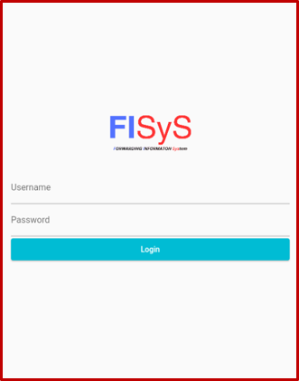
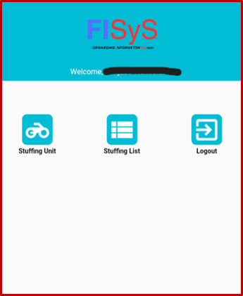
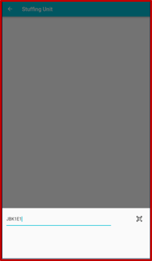
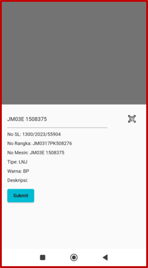
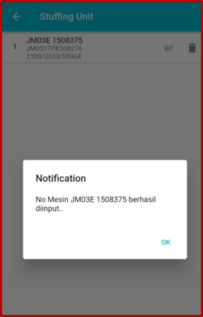
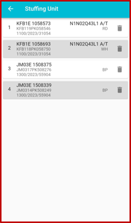
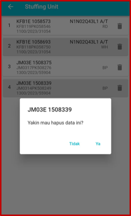
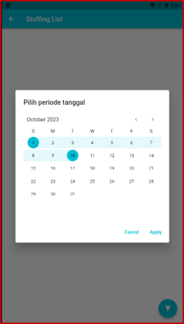
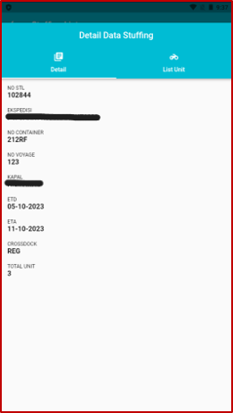

# FISys

**Forwarding Information System (Mobile App)**  
_A Flutter-based mobile application for managing and viewing shipping/stuffing data._

**Author:** Ivan D. R. Riadi — System Analyst & Programmer

---

## 📖 Overview

FISys is a mobile application built with **Flutter** to streamline freight forwarding operations.  
It allows users to scan barcodes/QR codes, retrieve associated unit data, and view organized lists for shipping/stuffing workflows.  

⚠ **Note:** This repository does **not** contain live API access.  
For privacy and security reasons, third-party company information and sensitive endpoints have been removed or censored.  
Screenshots below showcase the app in action using anonymized data.

---

## ✨ Features

- **Barcode/QR Code Scanning** — Quickly scan and retrieve stuffing list data.
- **Unit List Viewing** — See a detailed list of units in a stuffing list.
- **Local Storage** — Save session and API settings using `SharedPreferences`.
- **Responsive UI** — Optimized for mobile devices.

---

## 📸 Screenshots

> All screenshots have been censored to protect identities of third-party companies such as shipping expeditions.

---

## 🛠 Installation & Setup

# Clone the repository
git clone https://github.com/ryezheld/FISys.git

# Navigate into the project
cd project-repo

# Install dependencies
flutter pub get

# Run the app
flutter run
